# Open re-implementation of the Quansheng UV-K5/K6/5R v2.1.27 firmware

This repository is a fork of the [Egzumer](https://github.com/egzumer/uv-k5-firmware-custom) firmware, which itself is merge of [OneOfEleven custom firmware](https://github.com/OneOfEleven/uv-k5-firmware-custom) with [fagci spectrum analizer](https://github.com/fagci/uv-k5-firmware-fagci-mod/tree/refactor), along with my few changes.<br>
All is a cloned and customized version of DualTachyon's open firmware found [here](https://github.com/DualTachyon/uv-k5-firmware) ... a cool achievement !<br><br>

NOTE: This README has only barely been updated from the original Egzumer version.  All links still currently point to the original as it is mostly the same.<br><br>

> [!CAUTION]  
> Please note that the use of this firmware is entirely at your own risk.  There is no assurance that it will function correctly on your radio(s).  In the worst case scenario, it may render your radio(s) inoperable (commonly referred to as "bricking"), necessitating the purchase of a replacement.  Therefore, exercise caution and consider the potential consequences before proceeding with the installation or use of this firmware.

<br><br>

> [!IMPORTANT]
> For first use, I would highly recommend taking (and saving) a backup of your existing radio configuration through the official [CHIRP release](https://chirp.danplanet.com/projects/chirp/wiki/Download), using whatever firmware currently flashed.
> 1. Once you have that, flash this firmware - See [Releases](https://github.com/AubsUK/uv-k5-firmware-custom/releases)
> 2. Perform a factory reset (hold `PTT` + `SIDE BUTTON 1` while turning on the radio, after 'RELEASE ALL KEYS' navigate to Menu 77 `Reset` then select `ALL`) to clear some EEPROM locations that other firmware configures slightly differently
> 3. Use CHIRP with [Aubs UV-K5 CHIRP Driver](https://github.com/AubsUK/uvk5-chirp-driver) to read from radio
> 4. Copy/paste the channels from the backup in CHIRP to the downloaded configuration
> 5. Turn ScanLists off/on as required
> 6. Add channels to ScanLists as required
> 7. Finally upload back to the radio and you should see the model as `UV-K5 Aubs`

<br><br>

# Main differences
* The two ScanLists have been removed and replaced with 10 ScanLists (0-9)
* Channels no longer show which list they are in on the right side of the display
* When scanning, the ScanLists now show along the top of the screen
* Toggling ScanLists on/off is as simple as pressing the number
* Memory channels can now be excluded (Lockout/Skip) from scanning
* Memory channels can now be temporarily excluded while scanning (press `*` will lock out the channel until a power cycle)
* Scanning can be set to automatically start when the radio is turned on
* All the changes can be managed through CHIRP
* When factory resetting, it will only create ONE new channel instead of the original 5

<br><br>

# Usage

## Adding a memory channel to one or more lists
1. Switch to the required Memory Channel
2. Press the `Menu` button
3. Navigate to item 14 `ScnAdd`
4. Press the `Menu` button to edit
5. Press the number buttons, `0`..`9`, to add the channel to the respective list
6. Press the `Menu` button to exit.

## Scanning
1. Switch to a Memory Channel (MR not VFO)
2. (as previous) Press and hold the `*` key to start scanning
3. The ScanLists will now be shown along the top of the screen
    * If a ScanList is disabled, it will show as an underscore (_) 
    * If a ScanList is enabled, it will show as an:
        * Asterisk (*) if it is not the active ScanList
        * Number (0-9) if it is the active ScanList
5. Toggle each ScanList by pressing the corresponding number `1`..`9` (e.g. while scanning, to turn ScanList 1 on, press `1`, to turn ScanList 1 off, press `1` again)
### Note
* The LED will flash green once when a ScanList is turned on
* The LED will flash red once when a ScanList is turned off
* (as previous) to cancel scanning, press EXIT
* (as previous) when stopped on an active channel, press Menu to stop scanning and stay on the channel
* (as previous) to change direction, press up / down
* If the radio is tuned to a channel and the active ScanList is turned off, the radio will continue scanning

## Lockouts
The scanner can be set to permanently exclude (lockout/skip) channels from all lists
1. Switch to a Memory Channel
2. Press the `Menu` button
3. Navigate to item 15 `ScnLkO`
4. Press the `Menu` button to edit
5. Press `Up`/`Down` to toggle the lockout
6. Press the `Menu` button to save
The scanner can be set to temporarily exclude (temp lockout/skip) channels from all lists until the next power cycle
1. Make sure the radio is scanning memory channels
2. Press the `*` key
3. The LED will flash red twice
4. The radio will continue scanning
5. To reset temporary locked out channels, turn the radio off and back on


## Scan on start
1. Press the `Menu` button
2. Navigate to item 16 `ScnSrt`
3. Press the `Menu` button to edit
4. Press `Up`/`Down` to toggle Scan on Start 
5. Press the `Menu` button to save
4. Turn the radio off and back on:
    * If Scan On Start is `ON`, the radio will automatically start scanning
    * If Scan On Start is `OFF`, the radio will not automatically start scanning

## Review ScanList Members
1. Press the `Menu` button
2. Navigate to item 17 `SLists`
3. Press the `Menu` button to step into the list
4. Press `Up`/`Down` to scroll through all channels
5. Press keys `0`..`9` to switch between each ScanList
6. Press the `Exit` button to close
### Note
* At the bottom, there's a list of all ScanLists the current channel is in
* To get back to `ALL`, switch the radio off and back on again

<br><br>

# CHIRP
All the above can be set through CHIRP and I highly recommend you use it, as it makes it a lot easier.<br>
I have forked and modifidied Egzumer's CHIRP driver for the UV-K5 to manage the ScanLists, LockOut, and StartOnScan.<br>
[Aubs UV-K5 CHIRP Driver](https://github.com/AubsUK/uvk5-chirp-driver)

<br><br>

# ChangeLog
<table>
<tr><th>Version Number</th><th>Changes</th><th>Date</th></tr>
<tr>
<td>v00.01</td>
<td>
<ul>
<li>

Initial Release

</li>
</ul>
</td>
<td>2024-03-16T22:27:38Z</td>
</tr>
<tr>
<td>v00.02</td>
<td>
<ul>
<li>

Added a TempLockout while scanning, pressing `*` will lock out the channel until a powercycle, red flash twice and carry on scanning the next channel

</li>
<li>

Moved flashing of LED into the `FlashLED` function

</li>
</ul>
</td>
<td>2024-03-17T02:02:52Z</td>
</tr>
<tr>
<td>v00.03</td>
<td>
<ul>
<li>

Tidied up the menu by replacing `ScanList0`..`ScanList9` with `SLists`, switch between each using numbers on the keypad

</li>
<li>

Moved `SLists` to Menu item 17

</li>
<li>

A few bits of refractoring to reduce compiled code size

</li>
</ul>
</td>
<td>2024-03-20T22:41:24Z</td>
</tr>
<tr>
<td>v00.04</td>
<td>
<ul>
<li>

Fixed ScanList with no channels

</li>
<li>

Fixed scanning where the last channel in the ScanList is locked out

</li>
</ul>
</td>
<td>2024-03-24T22:33:22Z</td>
</tr>
<tr>
<td>v00.04</td>
<td>
<ul>
<li>

If the radio is tuned to a channel and the active ScanList is turned off, the radio will continue scanning

</li>
</ul>
</td>
<td>2024-03-27T22:11:47Z</td>
</tr>
</table>

<br><br>

# Photos
Scanning ScanLists 2,3,4,5,6,7, List 2 active<br><br>
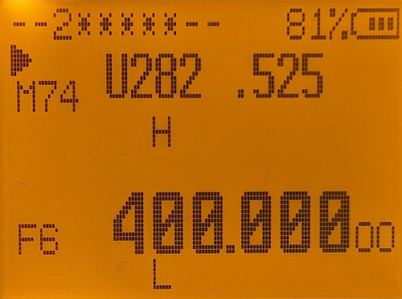<br><br>
Scanning ScanLists 2,3,4,5,6,7, List 4 active<br><br>
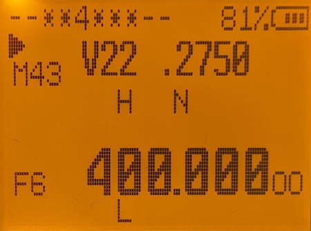<br><br>

Menu 14 >> Show ScanLists this channel is a member of<br><br>
<br><br>
Menu 14 >> Editing the ScanLists this channel is a member of (added 7)<br><br>
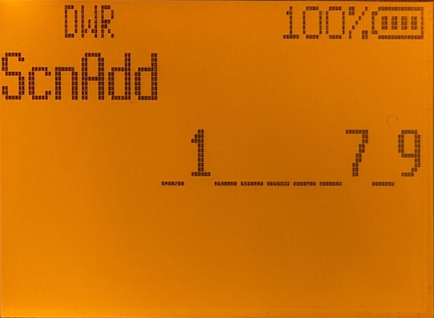<br><br>
Menu 14 >> Saved the ScanLists this channel is a member of<br><br>
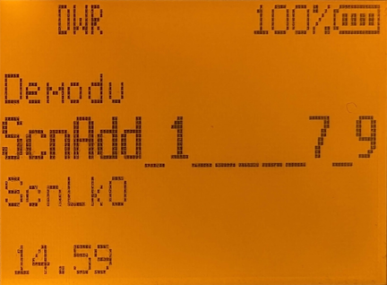<br><br>
Menu 15 >> Is this channel locked out of scanning<br><br>
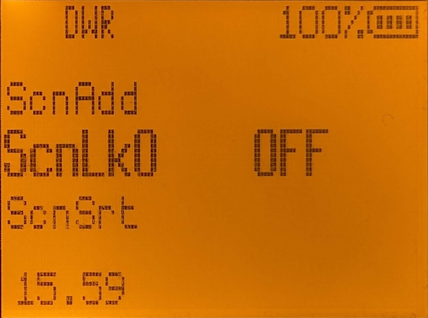<br><br>
Menu 16 >> Is Scan on Start enabled or disabled<br><br>
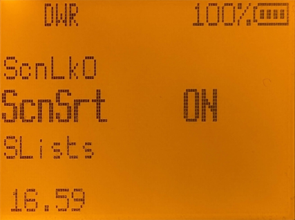<br><br>

Menus 17 >> List all channels or for each ScanList<br><br>
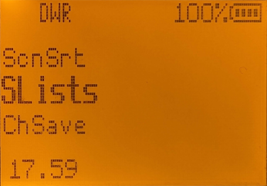<br><br>
Menus 17 >> Default to list all channels (ScanLists the channel is in at the bottom)<br><br>
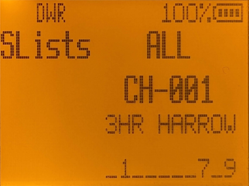<br><br>

Menus 17 >> Press `1` >> Members of ScanList 1 >> Press `Up` for next<br><br>
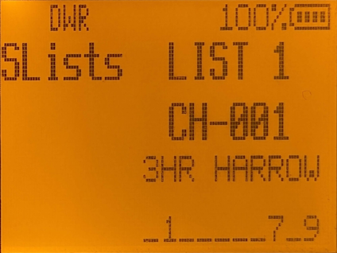
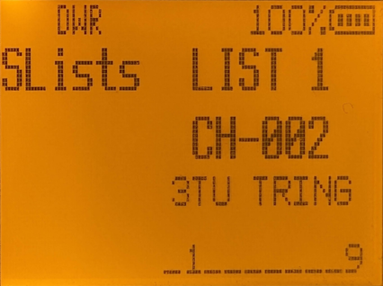<br><br>

Menus 17 >> Press `4` >> Members of ScanList 4 <br><br>
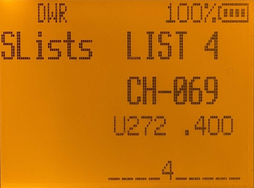<br><br>

Menus 17 >> Press `7` >> Members of ScanList 7 <br><br>
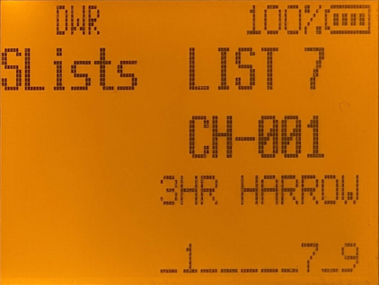<br><br>


CHIRP Download Menu<br><br>
<br><br>
CHIRP Memories showing LockOut and ScanLists<br><br>
<br><br>
CHIRP ScanList Settings<br><br>
<br><br>


<hr />
<hr />


> [!TIP]
> There is a work done by others on forks of this repository. I encourage you to take a look at those too. [SEE HERE](https://github.com/egzumer/uv-k5-firmware-custom/discussions/485)

> [!WARNING]  
> Use this firmware at your own risk (entirely). There is absolutely no guarantee that it will work in any way shape or form on your radio(s), it may even brick your radio(s), in which case, you'd need to buy another radio.
Anyway, have fun.

## Table of Contents

* [Main Features](#main-features)
* [Manual](#manual)
* [Radio Performance](#radio-performance)
* [User Customization](#user-customization)
* [Compiler](#compiler)
* [Building](#building)
* [Credits](#credits)
* [Other sources of information](#other-sources-of-information)
* [License](#license)
* [Example changes/updates](#example-changesupdates)

## Main features:
* many of OneOfEleven mods:
   * AM fix, huge improvement in reception quality
   * long press buttons functions replicating F+ action
   * fast scanning
   * channel name editing in the menu
   * channel name + frequency display option
   * shortcut for scan-list assignment (long press `5 NOAA`)
   * scan-list toggle (long press `* Scan` while scanning)
   * configurable button function selectable from menu
   * battery percentage/voltage on status bar, selectable from menu
   * longer backlight times
   * mic bar
   * RSSI s-meter
   * more frequency steps
   * squelch more sensitive
* fagci spectrum analyzer (**F+5** to turn on)
* some other mods introduced by me:
   * SSB demodulation (adopted from fagci)
   * backlight dimming
   * battery voltage calibration from menu
   * better battery percentage calculation, selectable for 1600mAh or 2200mAh
   * more configurable button functions
   * long press MENU as another configurable button
   * better DCS/CTCSS scanning in the menu (`* SCAN` while in RX DCS/CTCSS menu item)
   * Piotr022 style s-meter
   * restore initial freq/channel when scanning stopped with EXIT, remember last found transmission with MENU button
   * reordered and renamed menu entries
   * LCD interference crash fix
   * many others...

 ## Manual

Up to date manual is available in the [Wiki section](https://github.com/egzumer/uv-k5-firmware-custom/wiki)

## Radio performance

Please note that the Quansheng UV-Kx radios are not professional quality transceivers, their
performance is strictly limited. The RX front end has no track-tuned band pass filtering
at all, and so are wide band/wide open to any and all signals over a large frequency range.

Using the radio in high intensity RF environments will most likely make reception anything but
easy (AM mode will suffer far more than FM ever will), the receiver simply doesn't have a
great dynamic range, which results in distorted AM audio with stronger RX'ed signals.
There is nothing more anyone can do in firmware/software to improve that, once the RX gain
adjustment I do (AM fix) reaches the hardwares limit, your AM RX audio will be all but
non-existent (just like Quansheng's firmware).
On the other hand, FM RX audio will/should be fine.

But, they are nice toys for the price, fun to play with.

## User customization

You can customize the firmware by enabling/disabling various compile options, this allows
us to remove certain firmware features in order to make room in the flash for others.
You'll find the options at the top of "Makefile" ('0' = disable, '1' = enable) ..


|Build option | Description |
| --- | ---- |
|🧰 **STOCK QUANSHENG FEATURES**||
| ENABLE_UART | without this you can't configure radio via PC ! |
| ENABLE_AIRCOPY | easier to just enter frequency with butts |
| ENABLE_FMRADIO | WBFM VHF broadcast band receiver |
| ENABLE_NOAA | everything NOAA (only of any use in the USA) |
| ENABLE_VOICE | want to hear voices ? |
| ENABLE_VOX | |
| ENABLE_ALARM | TX alarms |
| ENABLE_TX1750 | side key 1750Hz TX tone (older style repeater access)|
| ENABLE_PWRON_PASSWORD | power-on password stuff |
| ENABLE_DTMF_CALLING | DTMF calling fuctionality, sending calls, receiving calls, group calls, contacts list etc. |
| ENABLE_FLASHLIGHT | enable top flashlight LED (on, blink, SOS) |
|🧰 **CUSTOM MODS**||
| ENABLE_BIG_FREQ | big font frequencies (like original QS firmware) |
| ENABLE_SMALL_BOLD | bold channel name/no. (when name + freq channel display mode) |
| ENABLE_CUSTOM_MENU_LAYOUT | changes how the menu looks like |
| ENABLE_KEEP_MEM_NAME | maintain channel name when (re)saving memory channel|
| ENABLE_WIDE_RX | full 18MHz to 1300MHz RX (though front-end/PA not designed for full range)|
| ENABLE_TX_WHEN_AM | allow TX (always FM) when RX is set to AM|
| ENABLE_F_CAL_MENU | enable the radios hidden frequency calibration menu |
| ENABLE_CTCSS_TAIL_PHASE_SHIFT | standard CTCSS tail phase shift rather than QS's own 55Hz tone method|
| ENABLE_BOOT_BEEPS | gives user audio feedback on volume knob position at boot-up |
| ENABLE_SHOW_CHARGE_LEVEL | show the charge level when the radio is on charge |
| ENABLE_REVERSE_BAT_SYMBOL | mirror the battery symbol on the status bar (+ pole on the right) |
| ENABLE_NO_CODE_SCAN_TIMEOUT | disable 32-sec CTCSS/DCS scan timeout (press exit butt instead of time-out to end scan) |
| ENABLE_AM_FIX | dynamically adjust the front end gains when in AM mode to help prevent AM demodulator saturation, ignore the on-screen RSSI level (for now) |
| ENABLE_AM_FIX_SHOW_DATA | show debug data for the AM fix |
| ENABLE_SQUELCH_MORE_SENSITIVE | make squelch levels a little bit more sensitive - I plan to let user adjust the values themselves |
| ENABLE_FASTER_CHANNEL_SCAN | increases the channel scan speed, but the squelch is also made more twitchy |
| ENABLE_RSSI_BAR | enable a dBm/Sn RSSI bar graph level in place of the little antenna symbols |
| ENABLE_AUDIO_BAR | experimental, display an audio bar level when TX'ing |
| ENABLE_COPY_CHAN_TO_VFO | copy current channel settings into frequency mode. Long press `1 BAND` when in channel mode |
| ENABLE_SPECTRUM | fagci spectrum analyzer, activated with `F` + `5 NOAA`|
| ENABLE_REDUCE_LOW_MID_TX_POWER | makes medium and low power settings even lower |
| ENABLE_BYP_RAW_DEMODULATORS | additional BYP (bypass?) and RAW demodulation options, proved not to be very useful, but it is there if you want to experiment |
| ENABLE_BLMIN_TMP_OFF | additional function for configurable buttons that toggles `BLMin` on and off wihout saving it to the EEPROM |
| ENABLE_SCAN_RANGES | scan range mode for frequency scanning, see wiki for instructions (radio operation -> frequency scanning) |
|🧰 **DEBUGGING** ||
| ENABLE_AM_FIX_SHOW_DATA| displays settings used by  AM-fix when AM transmission is received |
| ENABLE_AGC_SHOW_DATA | displays AGC settings |
| ENABLE_UART_RW_BK_REGS | adds 2 extra commands that allow to read and write BK4819 registers |
|🧰 **COMPILER/LINKER OPTIONS**||
| ENABLE_CLANG | **experimental, builds with clang instead of gcc (LTO will be disabled if you enable this) |
| ENABLE_SWD | only needed if using CPU's SWD port (debugging/programming) |
| ENABLE_OVERLAY | cpu FLASH stuff, not needed |
| ENABLE_LTO | reduces size of compiled firmware but might break EEPROM reads (OVERLAY will be disabled if you enable this) |

## Compiler

arm-none-eabi GCC version 10.3.1 is recommended, which is the current version on Ubuntu 22.04.03 LTS.
Other versions may generate a flash file that is too big.
You can get an appropriate version from: https://developer.arm.com/downloads/-/gnu-rm

clang may be used but isn't fully supported. Resulting binaries may also be bigger.
You can get it from: https://releases.llvm.org/download.html

## Building

### Github Codespace build method

This is the least demanding option as you don't have to install enything on your computer. All you need is Github account.

1. Go to https://github.com/egzumer/uv-k5-firmware-custom
1. Click green `Code` button
1. Change tab from `Local` to `Codespace`
1. Click green `Create codespace on main` button


5. Open `Makefile`
1. Edit build options, save `Makefile` changes
1. Run `./compile-with-docker.sh` in terminal window
1. Open folder `compiled-firmware`
1. Right click `firmware.packed.bin`
1. Click `Download`, now you should have a firmware on your computer that you can proceed to flash on your radio. You can use [online flasher](https://egzumer.github.io/uvtools)


### Docker build method

If you have docker installed you can use [compile-with-docker.bat](./compile-with-docker.bat) (Windows) or [compile-with-docker.sh](./compile-with-docker.sh) (Linux/Mac), the output files are created in `compiled-firmware` folder. This method gives significantly smaller binaries, I've seen differences up to 1kb, so it can fit more functionalities this way. The challenge can be (or not) installing docker itself.

### Windows environment build method

1. Open windows command line and run:
    ```
    winget install -e -h git.git Python.Python.3.8 GnuWin32.Make
    winget install -e -h Arm.GnuArmEmbeddedToolchain -v "10 2021.10"
    ```
2. Close command line, open a new one and run:
    ```
    pip install --user --upgrade pip
    pip install crcmod
    mkdir c:\projects & cd /D c:/projects
    git clone https://github.com/egzumer/uv-k5-firmware-custom.git
    ```
3. From now on you can build the firmware by going to `c:\projects\uv-k5-firmware-custom` and running `win_make.bat` or by running a command line:
    ```
    cd /D c:\projects\uv-k5-firmware-custom
    win_make.bat
    ```
4. To reset the repository and pull new changes run (!!! it will delete all your changes !!!):
    ```
    cd /D c:\projects\uv-k5-firmware-custom
    git reset --hard & git clean -fd & git pull
    ```

I've left some notes in the win_make.bat file to maybe help with stuff.

## Credits

Many thanks to various people on Telegram for putting up with me during this effort and helping:

* [OneOfEleven](https://github.com/OneOfEleven)
* [DualTachyon](https://github.com/DualTachyon)
* [Mikhail](https://github.com/fagci)
* [Andrej](https://github.com/Tunas1337)
* [Manuel](https://github.com/manujedi)
* @wagner
* @Lohtse Shar
* [@Matoz](https://github.com/spm81)
* @Davide
* @Ismo OH2FTG
* [OneOfEleven](https://github.com/OneOfEleven)
* @d1ced95
* and others I forget

## Other sources of information

[ludwich66 - Quansheng UV-K5 Wiki](https://github.com/ludwich66/Quansheng_UV-K5_Wiki/wiki)<br>
[amnemonic - tools and sources of information](https://github.com/amnemonic/Quansheng_UV-K5_Firmware)

## License

Copyright 2023 Dual Tachyon
https://github.com/DualTachyon

Licensed under the Apache License, Version 2.0 (the "License");
you may not use this file except in compliance with the License.
You may obtain a copy of the License at

    http://www.apache.org/licenses/LICENSE-2.0

    Unless required by applicable law or agreed to in writing, software
    distributed under the License is distributed on an "AS IS" BASIS,
    WITHOUT WARRANTIES OR CONDITIONS OF ANY KIND, either express or implied.
    See the License for the specific language governing permissions and
    limitations under the License.

## Example changes/updates

<p float="left">
  
  
  
</p>

Video showing the AM fix working ..

<video src="/images/AM_fix.mp4"></video>

<video src="https://github.com/OneOfEleven/uv-k5-firmware-custom/assets/51590168/2a3a9cdc-97da-4966-bf0d-1ce6ad09779c"></video>
